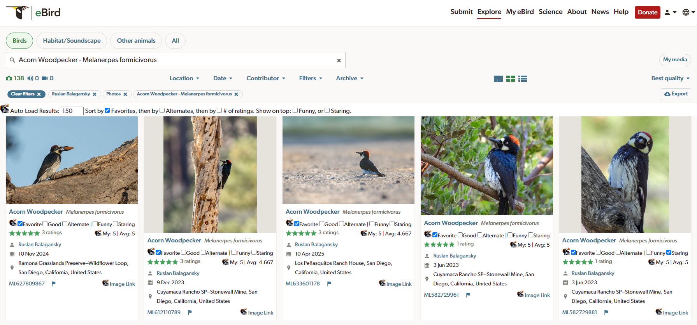
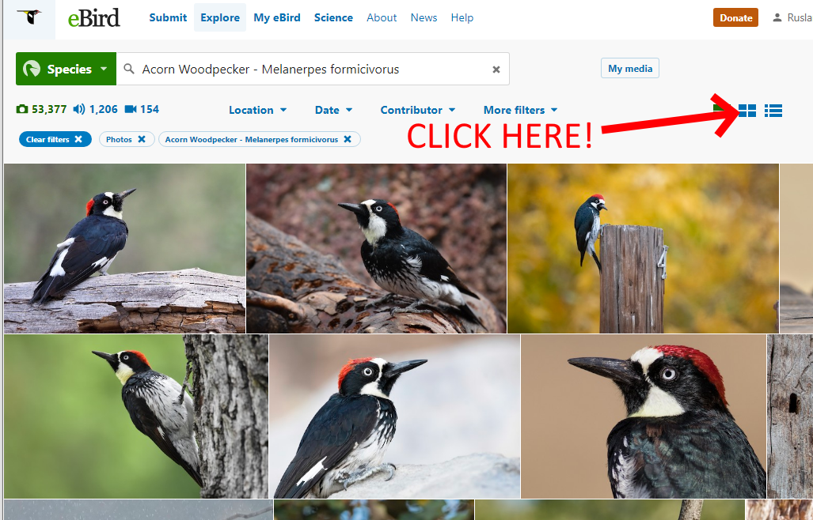

# eBird Acornizer

eBird Acornizer is a userscript that allows managing personal
(locally stored) ratings and tags for [eBird media](https://media.ebird.org/catalog).
It also displays a media asset's average rating.

  
  

Development was originally prompted by the desire to organize photos by "personal rating" - to
keep track of the "best" shots in an integrated manner, as this becomes more difficult as 
media volume increases and community average ratings diverge from contributor's own ratings.

## Features

In the future, this userscript may allow custom tags. For now, the following extra
tags are enabled:

* personal ratings: favorite, good, or alternate
* funny
* staring (bird is looking at the camera)

Additional features:

* Sort by custom tags
* Sort by number of ratings
* Import/export
* Show average rating
* Show your rating on search results
* Show link to high res photo

## Limitations

Currently, most functionality is limited to the Grid View of the eBird media search interface.

Currently, the userscript operates only on search results that have already been loaded. 
To assist with this, the userscript will auto-load results (essentially clicks 'More Results')
up to a configured maximum number of results (defaults to 100 and can be modified by the user).
Please note that it is possible to trip eBird's rate limiting by attempting to load "too many"
assets in a short period of time - if this happens, new assets will stop loading for a time.

The custom sorting and filtering functionality works best when viewing one's own media for a specific species,
since it can only operate on results loaded from eBird's built-in search queries.

This userscript also adds display of the average rating on individual macaulay library asset pages.

## Installing

First, you need a browser extension capable of running userscripts. I use https://www.tampermonkey.net/

On mobile, fewer browsers support such extensions (but FireFox is one).

The easiest way to install this userscript and keep it up to date is to install to it from https://greasyfork.org/en/scripts/555976-ebird-acornizer

## Using the Acornizer

To use the Acornizer, navigate to an eBird media search page
(e.g. [https://media.ebird.org/catalog?view=grid&mediaType=photo](https://media.ebird.org/catalog?view=grid&mediaType=photo))
or My eBird -> 'Species with photos'.
Make sure you are using Grid View (it's the middle of the three buttons near the center above the search results):

The Acornizer works best when viewing your own media for a single species. Note that the
Acornizer is currently only able to apply custom sorting to search results obtained through
the existing eBird search interface. You can increase or decrease the amount of results the
Acornizer will auto-load via the settings bar that appears above the search result grid.

If controls are not showing up, or you notice extra or missing search results, please try
refreshing the page.

## Can I help?

Yes! See [CONTRIBUTING.md](./CONTRIBUTING.md).

## Why "Acornizer"?

Organizer + Acorn = Acornizer.

Initially I envisioned adding an alternative to the "star rating" - an "acorn rating".
For the first release, I settled on just 3 named rating levels rather than a second
numeric rating system. This was quicker to implement and seemed more useful/intuitive.

Eventually the UI may yet be restyled such that acorn icons are used to denote this
userscripts's tags and ratings.

## Disclaimer

eBird Acornizer is an unofficial community project.
It is not affiliated with eBird or the Cornell Lab of Ornithology.