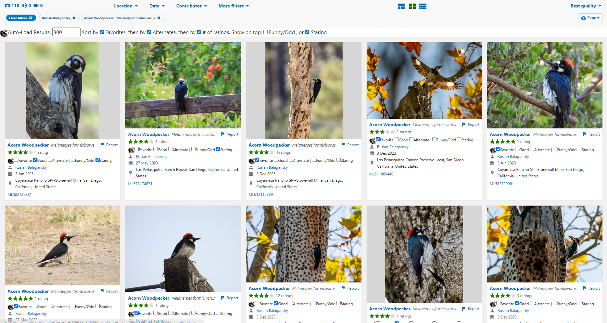

# eBird Acornizer

eBird Acornizer is a browser extension (for Chrome only at this time)
that allows managing personal (locally stored) ratings and tags for 
[eBird media](https://media.ebird.org/catalog).

  
  

Development was originally prompted by the desire to organize photos by "personal rating" - to
keep track of the "best" shots in an integrated manner, as this becomes more difficult as 
media volume increases and community average ratings diverge from contributor's own ratings.

## Features

In the future, this extension may allow custom tags. For now, the following extra
tags are enabled:

* personal ratings: favorite, good, or alternate
* funny
* staring (bird is looking at the camera)

Additional features:

* Sort by custom tags
* Sort by number of ratings
* Import/export (via extension Options)
* Show average rating
* Show link to high res photo

## Limitations

Currently all functionality is limited to the Grid View of the eBird media search interface.

Currently the extension operates only on search results that have already been loaded. 
To assist with this, the extension will auto-load results (essentially clicks 'More Results')
up to a configured maximum number of results (defaults to 300 and can be modified by the user).
Please note that it is possible to trip eBird's rate limiting by attempting to load "too many"
assets in a short period of time - if this happens, new assets will stop loading for a time.

The extension as currently written works best when viewing one's own media for a specific species. 

## Installing

Download this repository:

Unzip the files.

Navigate to [chrome://extensions](chrome://extensions), enable Developer mode, click 'Load Unpacked',
and point it at chrome_root inside the files you just unzipped.

### Updating

To update an existing installation, repeat the steps above,
but *completely replace* the original files with the newly downloaded files,
then browse to chrome://extensions and click the refresh icon on the extension.
It may be a good idea to first export your data just in case (via extension's Options page).

## Using the extension

To use the extension, navigate to an eBird media search page
(e.g. [https://media.ebird.org/catalog?view=grid&mediaType=photo](https://media.ebird.org/catalog?view=grid&mediaType=photo))
or My eBird -> 'Species with photos'.
Make sure you are using Grid View:

The extension works best when viewing your own media for a single species. Note that the
extension is currently only able to apply custom sorting to search results obtained through
the existing eBird search interface. You can increase or decrease the amount of results the
extension will auto-load via the settings bar that appears above the search result grid.

If controls are not showing up or you notice extra or missing search results, please try
refreshing the page.

## Can I help?

Yes! See [CONTRIBUTING.md](./CONTRIBUTING.md).

## Why "Acornizer"?

Organizer + Acorn = Acornizer.

Initially I envisioned adding an alternative to the "star rating" - an "acorn rating".
For the first release, I settled on just 3 named rating levels rather than a second
numeric rating system. This was quicker to implement and seemed more useful/intuitive.

Eventually the UI may yet be restyled such that acorn icons are used to denote this
extension's tags and ratings.

## Disclaimer

eBird Acornizer is an unofficial community extension.
It is not affiliated with eBird or the Cornell Lab of Ornithology.